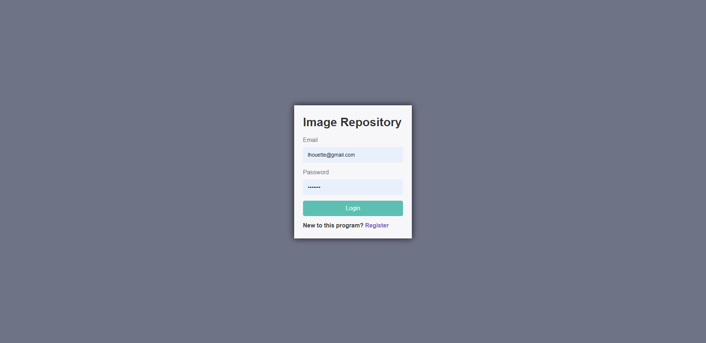
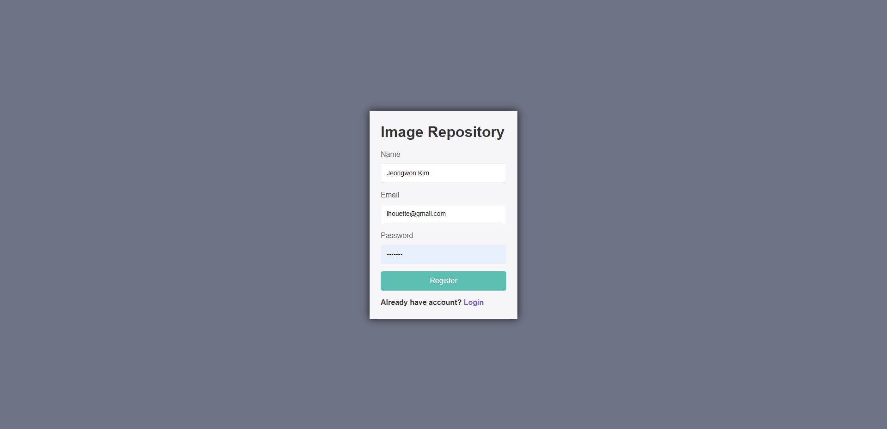
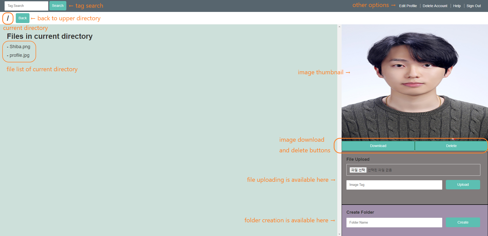
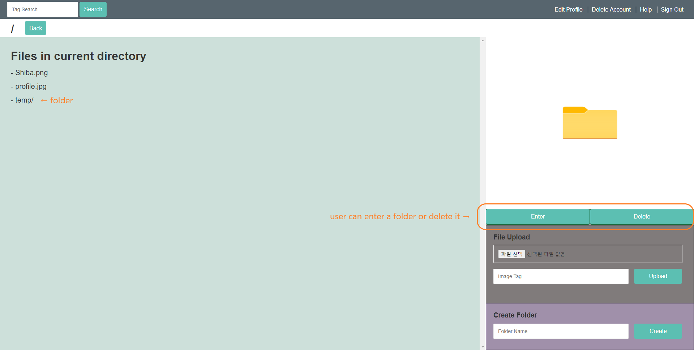
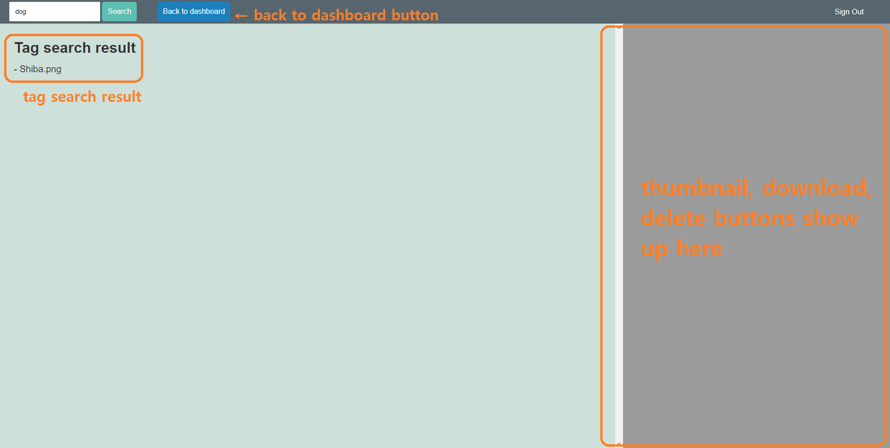

# Image repository

This node.js application provides an  **image repository service**  to users.
Using this application, users can save image files in their **private cloud repository** and manage them through the dashboard.
Users can **save** images, **search** tags, **download** images, and **delete** them through their private dashboard.

- [Run this app on Heroku](https://kim-image-repository.herokuapp.com/)
- [Github link](https://github.com/KumamonRiceCake/image-repository)

## Table of Contents

-  [How to use](#how-to-use)
-  [Features](#features)
-  [Run on local machine](#run-on-local-machine)
-  [Test](#test)

## How to use

### Open up the application on Heroku  ###
The app is deployed on Heroku.
It is accessible through the link: [https://kim-image-repository.herokuapp.com/](https://kim-image-repository.herokuapp.com/)

### Log in

If you already have an account, log in with your email address and password. If not, click the "Register" button.



### Sign up

You can create a new account using your **name**, **email address**, and **password**. Please note that the password must be at least 7 characters.



### Dashboard

If you successfully log in or sign up, you will see your private dashboard. On the left side, you will see your **images** and **folders** in the current directory. If you click an image, you can see its **thumbnail** on the right side. You can **download** the image or **delete** it by clicking the popup buttons under the image. You can also **upload a new image** or **create a folder** on the right side.



If you click a folder, you will see a folder image instead of an image thumbnail. You can **enter the folder** or **delete** it by clicking the popup buttons.



### Image tag search

You can search images with tags using the search box on top. Images with the same tag show up on the result page. You can also see thumbnails, download images, and delete images on this page.



## Features

* The user repository is managed **privately** and secured with **email** and **password** combinations.
* Image files are uploaded and managed through Amazon Simple Storage Service (**Amazon S3**).
* Saved user and image data are tracked by the  **MongoDB**  database management system.
* This program is quality assured with an integration test.

## Run on local machine

### Installation

To install the program, clone the whole code from [https://github.com/KumamonRiceCake/image-repository](https://github.com/KumamonRiceCake/image-repository) and execute the following in the downloaded folder.

```bash
$ npm install
```

### Run the program

Once dependency installation is finished successfully, execute the following command to start the **development version** of the application.

```bash
$ npm run dev
```

Then, open a browser (Chrome is preferred) and access [localhost:3000](localhost:3000).

## Test

All endpoints are fully tested using Jest and SuperTest.
To run the tests, clone the code from the Github link, download dependencies, and run the following command.

```bash
$ npm run test
```